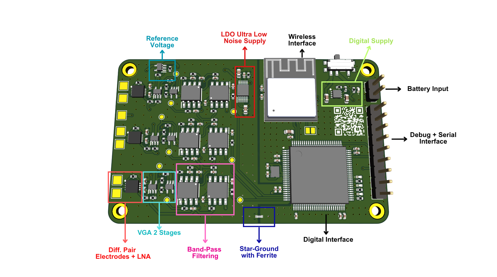

# 🧠 Wearable EEG Device – Biomedical Instrumentation I

> A wearable EEG system for real-time brain activity monitoring, designed with embedded systems and IoT principles.

  
   
  <b>EEG Hardware Prototype</b>

### Real-Time Interface (Qt)

  
   
  <b>Real-Time EEG Interface in Qt</b>

### Setup

  
   
  <b>Physical Setup</b>

---

## 📚 Project Overview

This project presents a **wearable Electroencephalogram (EEG) device** developed for the **Biomedical Instrumentation I** course. It aims to acquire and process low-amplitude human brain signals (**5µV to 300µV**) across standard EEG frequency bands:

* **Delta (δ):** 0.5 – 4 Hz
* **Theta (θ):** 4 – 8 Hz
* **Alpha (α):** 8 – 13 Hz
* **Beta (β):** 13 – 30 Hz
* **Gamma (γ):** 30 – 100 Hz

This is a full-stack biomedical system, integrating **analog signal conditioning**, **high-resolution digital conversion**, and **wireless data transmission** for real-time EEG visualization.

---

## ⚙️ Hardware Architecture

### 🧩 Microcontroller Core

* **STM32H730VBT** SoC
* Features a **16-bit SAR ADC** up to **3.6 MSPS**, ideal for high-resolution EEG data acquisition.

### 🔌 Analog Front-End (AFE)

EEG signals are amplified \~**12000x** and filtered in a 3-stage analog pipeline:

1. **INA333 Instrumentation Amplifier** – 20x gain + initial passive filtering
2. **OPA333 Operational Amplifier** – 600x gain
3. **6th-Order Passive Bandpass Filter** – 0.5 Hz (HP) to 45 Hz (LP)

### 📡 Communication & Storage

* **External Flash:** W25Q512JV QSPI NOR Flash for firmware and logs
* **Wireless Co-Processor:** ESP32-C6-MINI-1H4, communicating via UART

---

## 💾 Firmware Architecture

### STM32H7 Side (Signal Acquisition)

* **DFSDM Peripheral** used for enhanced digital filtering
* **Oversampling & Bit Shifting** increase ADC ENOB
* Implements **Wavelet Transform** for real-time brain wave classification

### ESP32 Side (Wireless Stack)

* Developed using **ESP-IDF** and **FreeRTOS**
* Handles:

  * Serial communication with STM32
  * Data packetization
  * **Wi-Fi communication** to local host
  * **MQTT protocol** for lightweight IoT data streaming

---

## 🧪 Real-Time EEG Visualization

On the host side:

* A **Qt** interface provides live graphical feedback of EEG signals.
* Visualizes brain wave patterns and band activity in real time.

---

## 🛠️ Technologies Used

| Layer            | Tools & Components                         |
| ---------------- | ------------------------------------------ |
| Microcontroller  | STM32H730VBT, STM32CubeIDE                 |
| Analog Circuitry | INA333, OPA333, RC Filters                 |
| Wireless         | ESP32-C6-MINI-1H4, ESP-IDF, FreeRTOS       |
| Protocols        | UART, MQTT, Wi-Fi                          |
| Host Interface   | Qt, C++, HTML5, WebSocket/MQTT |

---

## 🚧 Future Improvements

* ✅ Integrate live FFT for spectral analysis
* ✅ Mobile dashboard version
* 🔲 Dry electrodes support
* 🔲 Artifact rejection (e.g., blink/motion noise)
* 🔲 Bluetooth Low Energy (BLE) alternative

---

## 👨‍🔬 Authors & Acknowledgments
Stephan Costa Barros - 
Electrical Engineering Department – Federal University of Uberlândia (UFU), Brazil

